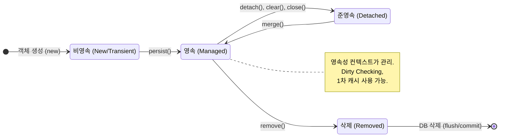

JPA를 이해하는데 가장 중요한 용어임 -> **엔티티를 영구 저장하는 환경** 이라는 뜻

EntityManager.persist(entity); -> 디비에 엔티티를 저장한다는말이 아니라 영속성컨텍스트에 엔티티를 저장한다는 코드임

# 엔티티의 생명주기



```
//객체를 생성한 상태(비영속)
Member member = new member();
member.setId("member1");
member.serUsername("회원1");

EntityManager em = emf.createEntityManager();
em.getTransaction().begin();

//객체를 저장한 상태(영속)
em.persist(meeber);
```
