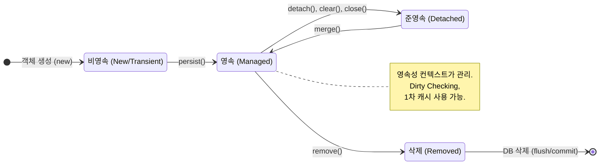

JPA를 이해하는데 가장 중요한 용어임 -> **엔티티를 영구 저장하는 환경** 이라는 뜻

EntityManager.persist(entity); -> 디비에 엔티티를 저장한다는말이 아니라 영속성컨텍스트에 엔티티를 저장한다는 코드임

# 엔티티의 생명주기



```
//객체를 생성한 상태(비영속)
Member member = new member();
member.setId("member1");
member.serUsername("회원1");

EntityManager em = emf.createEntityManager();
em.getTransaction().begin();

//객체를 저장한 상태(영속)
em.persist(meeber);
```
# 1차 캐시
시나리오1: 영속성컨텍스트(entityManager)에서 member1, member2를 조회

member1은 캐시에 저장되어있고 member2는 캐시에 저장되어있지 않음
### member1을 조회시
1차 캐시에서 조회
### member2를 조회시
1차 캐시에서 조회 -> 캐시에없음 -> 디비에서조회 -> 캐시에저장 -> 이후 member2를 조회시 디비를 거치지않고 캐시에서 조회함

하지만 보통 entityManager은 트랜잭션단위로 만들기 때문에 1차캐시가 큰의미가 있는것은 아님

```
//1차캐시
        try {
            
            //비영속
            Member member = new Member();
            member.setId(101L);
            member.setName("cash");

            //영속
            System.out.println("===BEFORE===");
            em.persist(member);
            System.out.println("===AFTER===");

            Member findMember = em.find(Member.class, 101L);

            System.out.println("findMember = "+ findMember.getId());
            System.out.println("findMember = "+ findMember.getName());
            

            Member findMember1 = em.find(Member.class, 101L);
            Member findMember2 = em.find(Member.class, 101L);
            tx.commit();
        } catch (Exception e) {
            tx.rollback();
        } finally {
            em.close();
        }
```
insert쿼리 이후 select쿼리가 실행되지않았고 select쿼리가 한번만 실행됨 -> 1차캐시에 저장되었기 때문

 


# 영속 엔티티의 동일성 보장
1차 캐시로 반복가능한 읽기(REPEATABLE READ)등급의 트랜잭션 격리 수준을 데이터베이스가 아닌 애플리케이션 차원에서 제공
```
Member findMember1 = em.find(Member.class, 101L);
Member findMember2 = em.find(Member.class, 101L);

System.out.println("result ="+(findMember1 == findMember2));
```


